# YA FundMind OS v1 System Architecture

## V1 最终定位

YA FundMind OS v1 是一个本地个人基金/ETF投研工作台。它的目标不是自动决策或自动交易，而是把每日基金/ETF研究流程稳定地自动化、证据化、可回看。

V1 交付形态：

- 本地运行，面向个人研究使用。
- 每日/每周自动运行。
- 自动生成 market intelligence、market trend、fund detail、portfolio analysis、news evidence、daily/weekly report、dashboard。
- 支持人工审核和人工结论沉淀。
- 不自动交易。
- 不输出买卖建议。
- 不承诺收益。
- 不接券商。
- Agent、Skill、MCP、LLM 放到 V2，不阻塞 V1。

## 架构总览

```mermaid
flowchart TB
  subgraph Config["配置层"]
    Watchlist["configs/watchlist.yaml<br/>自选基金/ETF"]
    Portfolio["configs/portfolio.yaml<br/>持仓配置"]
    Providers["configs/providers.yaml<br/>provider timeout/retry/trace"]
    Experiment["configs/experiment_scoring.yaml<br/>实验配置"]
    SchedulerConfig["ops launchd/cron templates<br/>本地定时配置"]
  end

  subgraph DataSource["数据源接入层"]
    Fixture["Fixture Provider<br/>demo/test"]
    AKShare["AKShare Provider<br/>基金/ETF基础数据"]
    Tiantian["Tiantian Provider<br/>详情/NAV enrichment"]
    NewsSource["News/Announcement Source<br/>V1 M4"]
  end

  subgraph Governance["数据治理层"]
    Normalize["字段标准化<br/>code/name/type/source/as_of"]
    Cache["SQLite Cache<br/>funds/details/navs"]
    Health["Provider Health<br/>warnings/severity/fallback"]
    Trace["Provider Trace<br/>JSON contract"]
    Contract["Contract Validation<br/>report/trace/snapshot"]
    Snapshot["Snapshots<br/>daily delta/history"]
  end

  subgraph Research["研究计算层"]
    DailyReport["Daily Report<br/>research priority"]
    MarketIntel["Market Intelligence<br/>theme/ranking/candidates"]
    MarketTrend["Market Trend<br/>theme trend validation"]
    FundDetail["Fund Detail<br/>watchlist drilldown"]
    PortfolioAnalysis["Portfolio Analysis<br/>M3"]
    NewsEvidence["News Evidence<br/>M4"]
    SignalLayer["Signal Candidate Layer<br/>experiment only"]
    Sandbox["Scoring/Risk Sandbox<br/>experiment only"]
  end

  subgraph Review["人工审核层"]
    ReviewQueue["Manual Review Queue"]
    ReviewState["Manual Review State"]
    ReviewGate["Review Gate<br/>no automatic promotion"]
  end

  subgraph Output["展示与报告层"]
    JSONReport["Machine JSON Reports"]
    MarkdownReport["Markdown Reports"]
    HTMLReport["HTML Reports"]
    Dashboard["Static Dashboard<br/>index/market/funds/review"]
    LatestSummary["outputs/latest_summary.md"]
    RunBundle["outputs/runs/YYYY-MM-DD"]
  end

  subgraph Ops["运行自动化层"]
    DailyOps["scripts/run_daily_ops.sh"]
    WeeklyOps["scripts/run_weekly_ops.sh"]
    OpsStatus["ops-status"]
    Launchd["launchd/cron"]
  end

  subgraph Future["未来扩展层 V2"]
    Agent["Agent 问答"]
    Skills["投资博主 Skill"]
    MCP["MCP"]
    LLM["LLM 自动解释"]
    Broker["券商/交易接入"]
    SaaS["SaaS/移动端/小程序"]
  end

  Config --> DataSource
  DataSource --> Governance
  Governance --> Research
  Research --> Review
  Review --> Output
  Research --> Output
  Output --> OpsStatus
  Ops --> Research
  Ops --> Output
  Output -. "只读扩展，不阻塞 V1" .-> Future
```

## 分层说明

### 配置层

配置层负责描述本地研究边界。V1 中 `watchlist` 和 `portfolio` 是用户输入的核心，不由系统自动改写。

- `configs/watchlist.yaml`: 自选池。
- `configs/portfolio.yaml`: 持仓配置。
- `configs/providers.yaml`: provider timeout、retry、trace retention、exit policy。
- `configs/experiment_scoring.yaml`: 实验评分沙箱配置。
- `ops/launchd`、`ops/cron`: 本地定时任务模板。

### 数据源接入层

数据源接入层只负责拉取和初步映射，不直接给出投资结论。

- Fixture Provider: demo 和测试路径，保证无网络也能跑。
- AKShare Provider: V1 daily 主数据源。
- Tiantian Provider: 基金详情和历史净值 enrichment。
- News/Announcement Source: V1 M4 目标，先做证据收集，不做舆情预测。

### 数据治理层

数据治理层是 V1 的稳定性核心。

- 标准化基金代码、名称、类型、source、as_of、updated_at、expires_at。
- SQLite cache 负责 live 失败后的 fallback 和历史本地读取。
- Provider health 和 warning severity 负责记录 fallback、stale、missing、skipped rows。
- Provider trace、JSON report、snapshot 都必须可被 contract validation 校验。
- 旧 snapshot/report/trace 必须兼容读取，新增字段优先作为可选字段。

### 研究计算层

研究计算层生成研究材料和实验材料，但 V1 默认不把实验信号提升到主评分/主风险。

- Daily Report: 当前主报告。
- Market Intelligence: 全市场基金/ETF主题和候选观察。
- Market Trend: 市场主题趋势稳定性观察。
- Fund Detail: 单只基金/自选池 drilldown。
- Portfolio Analysis: V1 M3 组合分析层。
- News Evidence: V1 M4 新闻公告证据层。
- Signal Candidate Layer 和 Scoring/Risk Sandbox: 仅实验和人工审核，不覆盖主模型。

### 人工审核层

人工审核层负责把机器输出转换为可追踪的人工判断。

- 记录需要更多数据、拒绝、继续实验、候选通过等状态。
- 不允许自动把实验信号接入主评分/主风险。
- 所有进入主模型的变更必须另开明确任务和回归测试。

### 展示与报告层

展示层面向人阅读和下游工具读取。

- 下游 Agent/Skill/Web 只能读 JSON report、trace、snapshot，不应解析 Markdown。
- Markdown/HTML 面向人阅读。
- Dashboard 是本地静态工作台，不是 SaaS。
- `outputs/runs/YYYY-MM-DD` 是每日可追溯运行包。

### 运行自动化层

运行层负责定时和状态检查。

- daily ops 每天生成 run bundle、summary、dashboard、ops status。
- weekly ops 聚合近期开销和证据。
- launchd/cron 只负责本地自动触发，不改变研究逻辑。

### 未来扩展层

V2 才考虑 Agent、Skill、MCP、LLM 自动解释、券商、SaaS、移动端和小程序。V1 不因这些方向阻塞。

## V1 不变量

- 不自动交易。
- 不接券商。
- 不输出买卖建议。
- 不承诺收益。
- 不把实验评分覆盖主评分。
- 不把实验风险覆盖主风险。
- 不让默认测试依赖真实网络。
- 不让下游解析 Markdown。
- 不因 V2 方向阻塞 V1 交付。
