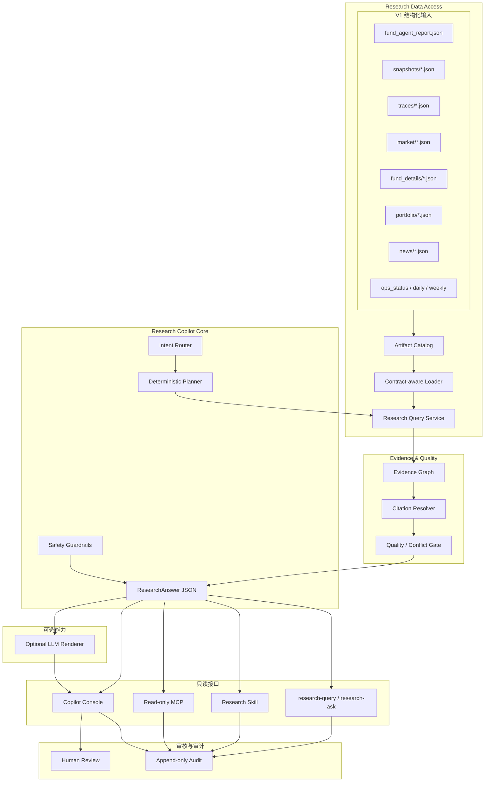

# YA FundMind OS v2 System Architecture

## V2 定位

YA FundMind OS v2 是建立在 V1 稳定数据和报告底座上的本地 Research Copilot。它把分散的 market、fund detail、portfolio、news、snapshot、provider trace 和 report JSON 统一为可查询、可引用、可审核的研究上下文。

V2 的核心价值不是“替用户做投资决定”，而是：

- 用一个统一入口回答本地研究问题；
- 让每个关键结论都能追溯到结构化证据；
- 在数据不足或质量下降时拒绝强结论；
- 让 CLI、Web、Skill 和 MCP 共享同一个只读查询核心；
- 让 LLM 成为可选的文字渲染器，而不是事实来源。

## 架构图



## 依赖规则

依赖只能从接口层向核心层、再向 V1 artifact 层流动：

```text
CLI / Web / Skill / MCP
-> Copilot Core
-> Evidence & Quality
-> Research Query Service
-> Artifact Catalog
-> V1 JSON artifacts
```

禁止反向依赖：

- V1 daily/weekly 不依赖 Copilot、MCP、LLM 或 Web。
- Artifact Catalog 不依赖具体 UI。
- Evidence 层不修改原始 artifact。
- LLM renderer 不直接读取文件系统或访问 provider。
- MCP/Skill 不直接绕过 Query Service 读取任意本地文件。

## 数据边界

### 可读

- `outputs/` 下已登记且通过 loader 策略的 JSON artifact。
- `configs/` 中明确允许展示的非敏感研究配置。
- contract 文档和 schema metadata。

### 可写

- `outputs/research_queries/`：结构化查询结果。
- `outputs/copilot/`：ResearchAnswer 和可选解释。
- `outputs/audit/`：不含敏感信息的追加式审计记录。
- `outputs/reviews/`：人工审核状态。

### 禁止写入

- `configs/watchlist.yaml`
- `configs/portfolio.yaml`
- 主评分和主风险配置
- provider cache 原始记录
- scheduler 配置
- 任意交易、券商或账户状态

## 核心组件

### Artifact Catalog

扫描白名单路径，输出稳定的 `ArtifactDescriptor`。文件缺失或 schema 不兼容时记录 warning，不让整个查询崩溃。

### Research Query Service

提供市场概览、主题变化、基金详情、组合暴露、新闻证据、历史比较和数据质量查询。返回结构化 `ResearchContext`，不生成自然语言投资结论。

### Evidence Graph

把 finding 与 artifact、JSON Pointer、时间、来源和质量关联。它不复制完整数据集，只保留必要证据引用。

### Quality / Conflict Gate

综合 stale、fallback、warning、degraded、样本不足和来源冲突，决定 finding 是否可展示、是否需要降级、是否要求人工审核。

### Research Copilot Core

将用户问题映射为受支持的 intent 和确定性查询计划，生成 `ResearchAnswer`。不支持的意图必须清晰拒绝或转为数据查询，不得生成买卖建议。

### Optional LLM Renderer

只接收已经冻结的 ResearchAnswer 和 evidence，不拥有文件、网络或配置写权限。失败时自动退回模板化渲染。

### Read-only Skill / MCP

只暴露白名单查询和状态工具，使用与 CLI 相同的核心服务。每次调用都有审计记录，禁止任意路径读取和写操作。

### Copilot Console

用于提交问题、查看回答、展开证据、检查数据质量、进行人工审核和查看 audit。它是本地工作台，不做公网、多用户或账号体系。

## 安全不变量

- 不自动交易，不接券商。
- 不输出买入、卖出、仓位或收益承诺。
- 不让不可信新闻文本或用户输入改变系统指令。
- 不记录 secret、token、Cookie、账号或 `.env` 内容。
- 默认测试和 CI 不访问真实网络。
- 主评分和主风险只有独立正式变更才能修改。
- V1 JSON contract 保持兼容；V2 使用独立 schema。

## 可用性不变量

- 没有 LLM 时 CLI 和结构化查询仍可用。
- Copilot/MCP/Web 失败不影响 daily/weekly。
- 单个 artifact 损坏不影响其他查询。
- 每个回答明确 as_of、data quality 和证据缺口。
- 所有新 JSON 都能通过 contract validation。
