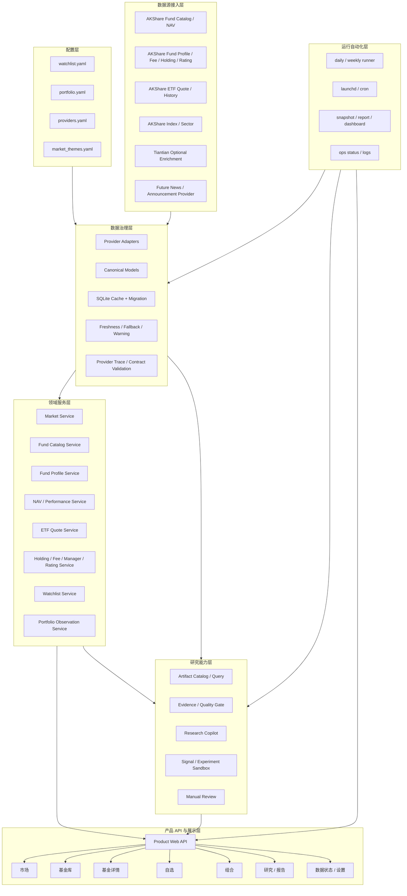

# YA FundMind OS V3 基金信息平台架构

## 最终定位

YA FundMind OS V3 是一个本地优先、开源、非交易型的个人基金/ETF 信息平台。“只读”指不写市场事实、基金数据、交易账户或订单；现有人工审核状态仍可写入本地审核文件。

它以 AKShare 当前可索引基金数据浏览为核心，提供：

- AKShare 当前可索引基金和 ETF 的搜索、筛选与分页。
- 主要指数、行业板块和 ETF 行情走势。
- 单只基金的概况、历史净值、业绩、风险、持仓、费率、经理、公司和评级。
- `configs/watchlist.yaml` 自选基金的独立工作区。
- `configs/portfolio.yaml` 组合的只读观察和数据缺口。
- 研究证据、Copilot、审核和报告等二级研究能力。
- 本地 daily/weekly 自动更新、缓存、trace 和数据质量诊断。

它不是交易系统：不自动交易、不接券商、不输出买卖建议、不承诺收益。开放式基金不显示不存在的交易所订单簿；V3 的交易所行情范围先限定为 ETF，不承诺 LOF 行情，不提供下单。

## 架构原则

1. **信息优先**：基金资料和行情是第一层，研究结论是第二层。
2. **类型分层**：开放式基金、ETF、ETF 联接和 QDII 使用不同展示语义。
3. **结构化事实**：前端只消费 API/JSON，不解析 Markdown。
4. **缺失即未知**：V3 provider/domain 使用 optional 值，产品 JSON 使用 `null/unknown`。legacy `FundRecord`、主评分和旧报告只通过显式兼容 adapter 保持原语义；不得直接改变主评分输入。
5. **诊断分层**：用户文案与工程诊断分离，原始状态只在系统页或抽屉中出现。
6. **本地优先**：SQLite cache、daily/weekly 和 loopback Web 保持默认。
7. **渐进增强**：AKShare 是 V3 主数据源；其他 provider 不阻塞基金核心资料。
8. **兼容 v2.6**：现有 contract、报告、Research Copilot、Skill/MCP 和 scheduler 不回归。

## 完整架构



## 领域模型

### FundCatalogEntry

用于 AKShare 当前可索引基金集合的搜索和列表，字段保持紧凑：

- `code`
- `name`
- `fund_type`
- `exchange_traded`
- `latest_nav_or_price`
- `as_of`
- `return_windows`
- `scale`
- `purchase_status`
- `source_summary`

“全部基金”在 V3 中不是对中国全部合法基金的绝对声明，而是以下 endpoint 在同一 `as_of` 的可索引并集：

- `fund_name_em`
- `fund_open_fund_rank_em`
- `fund_etf_spot_em`

代码先复用 `normalize_fund_code`；同一六位代码去重，不同份额类别若代码不同则分别保留。空代码、格式错误行和无法映射行进入 skipped/warning。每次目录刷新保存 endpoint 原始行数、规范化行数、去重数、跳过数和类型覆盖率，UI 使用“AKShare 基金库”而不是无来源限定的“全国全部基金”。

### FundProfile

用于基金详情概况：

- 基金全称、简称、代码、类型
- 发行/成立日期和成立规模
- 当前资产规模和份额规模，分别保存 `value/unit/as_of`
- 管理人、托管人、经理
- 业绩比较基准和跟踪标的
- 管理费、托管费、销售服务费，保留费用类型
- 申购/赎回状态、起购金额和确认日
- 分档认购/申购/赎回费，保留 `condition/channel/original_rate/discounted_rate`
- 按评级机构保存的评级摘要，保留 `agency/rating/as_of`
- 数据覆盖、数据日期和字段来源

### FundPerformance

- 单位净值、累计净值、历史点
- 1m/3m/6m/1y/all 区间摘要
- 日/周/月收益、最大回撤、波动率
- 同类位置和样本要求
- 分红/拆分事件

### EtfQuote

仅用于场内 ETF：

- 最新价、昨收、开高低
- 涨跌额/幅
- 成交量、成交额、换手率
- IOPV、折溢价
- 买一/卖一、内盘/外盘等数据源实际提供字段
- 行情时间、source、stale
- 历史行情复权口径 `adjust`；默认不复权，UI 必须标注

该模型是只读行情快照，不包含订单、账户、可买数量或交易动作。

### FundHoldingSnapshot

- 报告期
- 股票/债券持仓
- 占净值比例
- 持仓市值
- 资产配置比例
- 数据披露滞后说明

### ProviderDiagnostics

保留现有 provider health、warning、trace、contract 和 cache 元数据，但只供系统页、API diagnostics 和开发排障使用。

## 页面信息架构

```text
市场
  ├─ 指数
  ├─ 行业板块
  └─ ETF 行情
基金
  ├─ AKShare 基金库
  ├─ ETF
  └─ 基金详情
自选
组合
研究
  ├─ 证据
  ├─ Research Copilot
  ├─ 人工审核
  └─ 报告
系统
  ├─ 数据状态
  ├─ 自动运行
  └─ 关于 / 设置
```

用户默认入口为“市场”或“基金”，不是报告和 Copilot。

## 基金详情页面契约

### 通用标签页

1. 概览
2. 净值与业绩
3. 持仓与配置
4. 费率与规则
5. 经理与公司
6. 评级与同类
7. 分红/拆分
8. 研究证据（有真实数据时）

### ETF 增量标签页

- 交易行情
- ETF 价格历史
- IOPV 与折溢价
- 流动性摘要

### 开放式基金差异

- 不展示买一/卖一和盘口。
- 展示最新净值、估值日期、申购/赎回状态、确认日和费用。
- “交易信息”统一命名为“申购赎回与费率”。

## 数据流

### 定时更新

```text
launchd
-> daily runner
-> AKShare catalog / ETF / market fetch
-> canonical mapping
-> SQLite upsert
-> structured artifacts
-> Product Web reload
```

### 按需详情

```text
Fund detail request
-> FundProfileService
-> fresh cache hit
-> otherwise provider fetch
-> field-level mapping and warning
-> cache write
-> product view model
-> diagnostics separated
```

按需请求失败时允许 stale fallback，但用户页面只显示“数据更新受限，当前展示缓存日期”；完整错误只进 diagnostics。

### Endpoint 调用策略

| 类别 | Endpoint | 调用方式 | 默认刷新预算 | 失败隔离 |
| --- | --- | --- | --- | --- |
| 全量目录 | `fund_name_em`、`fund_open_fund_rank_em`、`fund_etf_spot_em` | daily snapshot | 每个 daily 至多一次 | 单 endpoint 失败保留其他目录和旧缓存 |
| 全量参考 | `fund_purchase_em`、`fund_rating_all`、`fund_manager_em` | TTL snapshot | 默认 24 小时至 7 天，按数据类型配置 | 失败使用对应旧 snapshot，不触发逐基金重试 |
| 单基金资料 | `fund_overview_em`、`fund_fee_em` | 详情按需 | fresh cache 命中不访问网络 | 单块失败返回 partial profile |
| 单基金历史 | `fund_open_fund_info_em`、`fund_etf_hist_em` | 详情按需 | 按 code/window/adjust 缓存 | live 失败仅在有缓存时 fallback |
| 单基金披露 | `fund_portfolio_hold_em` 等 | 详情按需 | 按 code/report_period 缓存 | 不影响概况和净值 |

具体 TTL 在 M2/M4 contract 中冻结；不得从详情页对全量 endpoint 做每基金调用。

## API 边界

- API 返回产品化 view model，不返回 pandas/DataFrame 结构。
- 所有时间字段区分 `as_of` 和 `updated_at`。
- API 始终返回稳定枚举/code，可选返回 `display_message`；中文本地化由 Web translation map 完成，diagnostics 保留相同机器稳定 code。
- 分页、排序和筛选在服务端执行。
- Web 不触发批量全市场 live 请求。
- 默认 API 只绑定 loopback；公网部署不属于 V3 核心验收。

## 兼容与迁移

- v2.6 JSON contract 不删除、不重命名字段。
- V3 新模型使用独立 schema/version，旧 outputs 继续可读。
- SQLite 只做前向、可重复 migration，不删除用户 cache 和历史。
- Research Copilot 继续消费结构化 artifact；不要求理解 V3 页面。
- M1-M5 每个 Milestone 可独立回滚到上一 tag。

## 开源边界

- 默认 fixture 和离线测试不访问真实网络。
- AKShare 为第三方依赖，README 明确上游时效、可用性和许可边界。
- 不提交 outputs、cache、用户持仓、日志或 secret。
- 公网部署、账号、多用户、新闻内容再分发必须另行评审。
