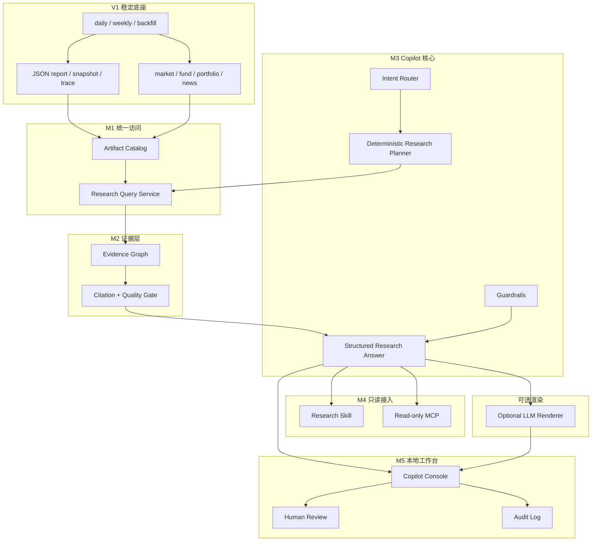

# YA FundMind OS v2 Research Copilot 设计

## 1. 最终目标

YA FundMind OS v2 的最终定位是：**本地优先、证据驱动、可解释、只读的基金/ETF Research Copilot**。

用户可以针对市场、主题、自选基金、持仓组合、新闻证据和历史变化提出研究问题。系统必须基于 V1 已生成的结构化 JSON 产物回答，并为关键结论附带数据来源、时间、质量等级和可定位的证据引用。

V2 必须同时满足：

- 没有 LLM、没有外部 API key 时仍可完成确定性的结构化研究查询和解释。
- 可选 LLM 只负责语言组织，不负责凭空产生事实或改变数值结论。
- V1 daily/weekly、报告、dashboard、主评分和主风险继续稳定运行。
- 不自动交易，不接券商，不输出买入/卖出/仓位指令，不承诺收益。

## 2. 方案评审

### 方案 A：只做 V1.1 数据覆盖增强

优点：变更最小，风险低。

缺点：仍然需要用户自己在多个页面和 JSON 之间寻找答案，不能形成大版本级用户价值。

### 方案 B：直接做云端 SaaS、自动推荐和交易联动

优点：产品形态完整。

缺点：需要账号、权限、部署、隐私、合规、券商和真实资金风控，远超当前本地研究系统的可信边界。

### 方案 C：本地 Evidence-grounded Research Copilot（采用）

优点：最大化复用 V1 的 JSON contract、snapshot、provider trace、market、fund detail、portfolio 和 news evidence；能形成统一研究入口，同时保持本地、只读和可审计。

缺点：必须先建设统一数据访问、证据引用和安全边界，不能从聊天界面直接开始。

## 3. 产品边界

### V2 范围内

- 统一发现和读取 V1 机器可读产物。
- 面向市场、基金、组合、新闻和历史变化的结构化查询。
- 所有关键研究结论附带 evidence citation。
- 数据缺失、过期、fallback、warning、degraded 的显式提示。
- 受约束的 Research Copilot CLI。
- 可选 LLM renderer，默认关闭。
- 只读 MCP/Skill 接口。
- 本地 Copilot Console、人工审核和审计记录。

### V2 范围外

- 自动推荐基金。
- 买入、卖出、加仓、减仓、止盈、止损或目标仓位指令。
- 自动交易、券商接入或账户凭据。
- 云端 SaaS、多用户权限、移动端和小程序。
- 未经独立模型评审修改主评分或主风险。
- 让下游解析 Markdown 获取事实。

## 4. 系统架构



## 5. 核心数据结构

### ArtifactDescriptor

描述一个可查询的机器产物：

- `artifact_id`
- `artifact_type`
- `path`
- `schema_version`
- `as_of`
- `generated_at`
- `source`
- `quality_grade`
- `stale`
- `content_hash`

### EvidenceRef

描述一个研究结论的证据：

- `evidence_id`
- `artifact_id`
- `json_pointer`
- `claim_type`
- `as_of`
- `source`
- `quality_grade`
- `excerpt`
- `metadata`

`excerpt` 只能包含必要的短片段；结构化数值必须以原字段和值表达，不复制整份产物。

### ResearchAnswer

Copilot 的机器可读输出：

- `schema_version`
- `question`
- `intent`
- `answer_status`
- `summary`
- `findings`
- `evidence`
- `data_gaps`
- `warnings`
- `review_required`
- `not_investment_advice=true`
- `generated_at`
- `generator`

## 6. 关键设计决策

### 6.1 结构化事实优先

所有查询先通过 Artifact Catalog 和 Query Service 获得结构化事实，再生成解释。禁止从 Markdown、HTML 或自然语言报告反向解析事实。

### 6.2 确定性核心、可选 LLM

没有 LLM 时，系统仍可输出结构化结论、表格和模板化中文解释。LLM 只能读取已选定的事实与证据，不能自行访问网络、修改数值、改变质量等级或产生交易动作。

### 6.3 证据不足时拒绝强结论

出现 stale、fallback、critical warning、样本不足或证据冲突时，ResearchAnswer 必须降低置信度、写入 `data_gaps`，必要时设置 `review_required=true`。

### 6.4 接口默认只读

CLI、Skill 和 MCP 默认只能读取 outputs 和写入独立的 query/audit 产物。它们不能修改 watchlist、portfolio、评分、风险、scheduler 或交易状态。

### 6.5 向后兼容

V1 contract 不删除、不重命名、不改变字段语义。V2 新增独立 contract；旧 artifact 缺少可选字段时安全降级。

## 7. 用户流程

```text
用户问题
-> 意图分类
-> 只读查询计划
-> Artifact Catalog 定位数据
-> Evidence Graph 生成引用
-> Quality Gate 降级或阻断不可靠结论
-> 生成结构化 ResearchAnswer
-> 可选模板/LLM 渲染
-> 人工审核与审计记录
```

第一版必须覆盖：

- “今天市场和主题有什么变化？”
- “这只自选基金的现状、数据缺口和历史变化是什么？”
- “当前组合的主题暴露和集中度是什么？”
- “哪些新闻证据与当前主题相关，可信度如何？”
- “本期和上一期相比变化在哪里？”
- “为什么系统不能对某个问题给出可靠结论？”

## 8. 错误和降级

- artifact 缺失：返回 `partial`，列出缺失产物，不抛出未处理异常。
- contract 不兼容：跳过该 artifact，记录 warning 和 schema version。
- stale/fallback：保留事实但显式降低质量，不生成正向推荐。
- 证据冲突：并列展示冲突来源，要求人工审核。
- LLM 不可用：自动使用确定性 renderer，不影响核心查询成功。
- MCP/Console 不可用：CLI 和 V1 daily/weekly 保持可用。
- 敏感信息：禁止写入 query、audit、trace 和错误日志。

## 9. 里程碑与版本

### M1：Research Data Access，发布 `v1.1.0`

建立 Artifact Catalog、统一查询契约和 `research-query` CLI。效果：下游首次可以通过一个稳定 JSON 接口读取 V1 全部研究产物。

### M2：Evidence & Citation，发布 `v1.2.0`

建立 Evidence Graph、citation、质量门和证据冲突处理。效果：每个关键研究结论都能追溯到 artifact 和 JSON 字段。

### M3：Research Copilot Core，发布 `v1.3.0`

建立意图路由、确定性研究计划、guardrails 和 `research-ask` CLI。效果：用户可用自然语言问题获得结构化、可解释、非交易型回答。

### M4：Read-only Skill / MCP，发布 `v1.4.0`

提供只读 Skill 和 MCP 工具，外部 Agent 只能读取结构化答案和证据。效果：可接入其他工具，但不能修改本地投资配置或执行交易。

### M5：Copilot Console，发布 `v1.5.0`

在本地 Web Console 增加问答、证据查看、人工审核和 audit 页面。效果：非命令行用户可以完成完整研究和审核流程。

### M6：Release Hardening，发布 `v2.0.0-rc.1` 和 `v2.0.0`

完成兼容、性能、安全、迁移、文档和端到端验收。效果：V2 成为可稳定每日使用的本地 Research Copilot。

Milestone 内修复使用 patch 版本，例如 `v1.1.1`。每个版本必须通过独立分支、focused commit、PR、CI、merge 和 tag。

## 10. V2 总体验收标准

- V1 daily/weekly、fixture、AKShare、dashboard、report 和 Web Console 不回归。
- `research-query` 与 `research-ask` 无 LLM、无网络时可用。
- 六类核心问题都有自动化测试和示例输出。
- 每个关键 finding 至少有一个可定位 EvidenceRef；没有证据时不得伪造结论。
- stale、fallback、warning、degraded、冲突和缺失数据均能安全降级。
- MCP/Skill 全部只读并有权限测试。
- Console 能查看问题、回答、证据、质量状态、审核和 audit。
- 默认 pytest/CI 不访问真实网络。
- 所有 V2 JSON contract 有 schema version、校验命令和兼容性测试。
- 主评分、主风险、watchlist、portfolio 不被 Copilot 自动修改。
- 输出不包含买卖、仓位或收益承诺，不执行交易，不接券商。

## 11. 自主执行授权

用户已明确授权：由 Codex 自主设定中间步骤和验收门槛，达到 gate 后继续推进，不需要逐 Milestone 等待确认。

以下情况仍必须暂停并重新评审：

- 需要付费外部服务或新增 secret 才能完成核心功能。
- 需要改变主评分、主风险、交易边界或 V1 contract 语义。
- 需要删除用户数据、outputs、scheduler 或历史 artifact。
- 连续三次修复仍无法通过同一 gate，表明架构假设可能错误。
