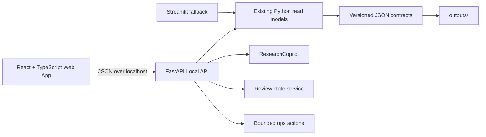

# YA FundMind OS 产品化 Web Console 设计

## 1. 背景与目标

当前项目已经具备 Streamlit Web Console，能够读取本地研究产物并展示 Home、Copilot、Market、Funds、Portfolio、News、Review、Reports 八个页面。它满足 V1 的功能验证，但仍是内部工具形态：页面层级较弱、首屏信息密度偏低、表格和证据缺少连续的钻取体验，移动端与平板端也没有形成稳定的信息架构。

本次建设一个独立的产品化 Web Console：

- 使用 React + TypeScript 提供稳定的应用外壳、路由和交互。
- 使用本地 FastAPI 只读接口消费现有 JSON contract 与 Python service。
- 保留现有 Streamlit Console 作为兼容入口和运维回退路径。
- 不改变主评分、主风险、daily 默认 provider、watchlist、portfolio 或 scheduler。
- 不自动交易、不接券商、不输出买卖建议或收益承诺。

该前端在独立分支完成。v2.0.0 Final 发布前不得合并到 `main`，避免改变 RC 的运行证据和发布 provenance。

## 2. 当前差距

| 维度 | 当前 Streamlit 状态 | 产品化目标 |
| --- | --- | --- |
| 导航 | 顶部标签页，页面较多时扫描成本高 | 固定侧栏、清晰路由、移动端抽屉 |
| 首屏 | 标题、按钮和少量指标，留白较大 | 状态条、关键指标、待复核事项和最新研究摘要 |
| 数据浏览 | 以静态表格和展开块为主 | 筛选、排序、详情抽屉、证据关联 |
| 状态表达 | 错误和空数据分散在各页面 | 统一 loading / empty / error / stale / degraded 状态 |
| 证据链 | 能展示引用，但跨页面关联弱 | 统一 citation drawer，保留来源与时间戳 |
| 响应式 | 依赖 Streamlit 自适应 | 明确支持 375 / 768 / 1440 三类视口 |
| 运行边界 | 页面可触发 daily 与 review | 所有写操作显式确认、固定参数、限制本地调用 |

## 3. 信息架构

### 3.1 页面

| 路由 | 页面 | 核心任务 |
| --- | --- | --- |
| `/` | Overview | 查看运行健康、数据质量、研究摘要和待处理事项 |
| `/market` | Market | 查看市场热度、趋势、板块证据与历史变化 |
| `/funds` | Watchlist | 查看自选基金详情、数据新鲜度和候选信号 |
| `/portfolio` | Portfolio | 查看持仓暴露、集中度、观察性风险和数据缺口 |
| `/news` | News | 浏览新闻/公告证据，按主题、基金和来源筛选 |
| `/copilot` | Copilot | 基于本地 JSON 研究证据回答问题并展示引用 |
| `/review` | Review | 处理人工复核队列并记录本地审核状态 |
| `/reports` | Reports | 查找、预览和打开已生成的报告与运行产物 |

页面命名以用户任务为中心。`Funds` 在导航中显示为“自选研究”，明确其数据来自 watchlist，而不是全市场基金池。

### 3.2 任务模型

用户进入应用后的主要顺序是：

1. 在 Overview 确认最新运行是否成功、数据是否 stale/degraded。
2. 在 Market 判断近期板块变化，并打开关联证据。
3. 在 Watchlist 和 Portfolio 查看这些变化与个人观察对象的关系。
4. 在 Copilot 提问或在 Review 处理需要人工判断的证据。
5. 在 Reports 查看机器报告和历史运行产物。

## 4. 技术架构

### 4.1 目录边界

- `web/`：Vite、React、TypeScript、组件、页面和前端测试。
- `fund_agent/web_api.py`：FastAPI app factory、允许列表路由和静态资源挂载。
- `fund_agent/web_console.py`：保留 Streamlit，实现既有兼容行为。
- `tests/test_web_api.py`：API contract、路径限制和错误状态测试。
- `web/src/**/*.test.tsx`：组件与页面行为测试。

### 4.2 API 草案

所有接口仅绑定 `127.0.0.1`，数据目录在服务启动时固定，不接受任意文件系统路径或 URL。

| 方法 | 路径 | 行为 |
| --- | --- | --- |
| GET | `/api/health` | 返回服务版本、输出目录状态和只读边界 |
| GET | `/api/overview` | 返回 ops、latest summary、数据质量和待复核数量 |
| GET | `/api/market` | 返回 market intelligence/trend 的结构化数据 |
| GET | `/api/funds` | 返回 watchlist fund details 与候选信号摘要 |
| GET | `/api/portfolio` | 返回组合研究报告，不生成交易动作 |
| GET | `/api/news` | 返回新闻/公告 evidence |
| GET | `/api/reports` | 返回允许列表内的本地报告元数据 |
| POST | `/api/copilot/ask` | 调用现有 ResearchCopilot，返回带 citation 的 JSON |
| GET | `/api/reviews` | 返回 review queue 与当前 review state |
| POST | `/api/reviews/{review_id}` | 更新审核状态；校验 status 和文本长度 |
| POST | `/api/ops/refresh-dashboard` | 显式确认后刷新 dashboard |
| POST | `/api/ops/daily` | 显式确认后用固定 provider 触发本地 daily；默认不在首版开放 |

首版不提供任意命令执行、任意路径读取、任意网络请求或配置写入接口。

## 5. 数据与状态权威

- JSON report、snapshot、provider trace、research context、evidence 和 review state 是机器读取入口。
- Markdown/HTML 只用于人类展示，前端不得解析 Markdown 来恢复结构化数据。
- `build_web_console_state` 继续作为兼容聚合层；新 API 优先复用已有 service，不复制研究规则。
- 页面显示 `source`、`as_of`、`updated_at`、`stale`、`data_quality_grade` 等来源与新鲜度信息。
- 缺失字段显示为“暂无数据”，不得推断或构造正向信号。

## 6. 视觉与布局模型

### 6.1 视觉语言

- 定位：安静、紧凑、面向重复工作的本地投研工作台。
- 中性浅色底；青绿色表示健康/通过，蓝色表示信息，琥珀色表示 warning，红色表示 critical。
- 不使用大面积紫色、深蓝、米色单色主题，不使用装饰性渐变球或营销 hero。
- 卡片圆角不超过 8px；页面 section 使用无边框布局，卡片只承载独立重复项或工具。
- 图标统一使用 Lucide；熟悉动作优先图标按钮并提供 tooltip。
- 字号固定分级，不按视口宽度缩放；letter spacing 为 0。

### 6.2 几何约束

- 桌面侧栏宽 232px，可折叠到 72px。
- 顶部状态栏固定，包含运行日期、provider、数据质量和 stale/fallback 状态。
- 主内容最大宽度 1600px，页面水平 padding 为 24px；移动端为 16px。
- KPI 使用稳定网格，桌面 4 列、平板 2 列、移动端 1 列。
- 表格在窄屏使用水平滚动或切换为键值行，不允许文本与操作重叠。
- 图表容器使用固定最小高度和 aspect ratio，加载或空状态不得导致布局跳动。

## 7. 关键交互

- 侧栏切换页面，当前路由保持高亮，移动端选择后自动收起。
- 表格支持客户端筛选、排序和快速搜索；不在浏览器重算评分。
- 点击 evidence、warning 或 signal 打开右侧详情抽屉，展示来源、时间、质量和关联项。
- Review 提交前显示状态变更摘要；成功后刷新局部状态，失败时保留输入。
- Copilot 问题以本地结构化回答显示；引用可展开，拒答和证据不足有独立状态。
- Ops 写操作必须显式确认，显示执行中、成功和失败状态；真实异常不得吞掉。

## 8. 状态与错误模型

每个页面统一覆盖：

- `loading`：使用固定高度 skeleton，不改变布局。
- `empty`：说明缺少哪一类本地产物及其生成命令。
- `error`：显示稳定错误代码和可执行恢复步骤，不泄露堆栈或本地敏感路径。
- `stale`：顶部和相关模块显示 warning，不伪装为 live。
- `degraded`：显示全局数据质量标识，但仍允许读取已生成报告。
- `refused`：Copilot 因证据不足拒答时明确说明，不生成建议。

## 9. 安全与产品边界

- 默认只监听 `127.0.0.1`，不提供公网部署或认证承诺。
- API 不接受任意 output dir、文件路径、shell command、provider URL 或环境变量值。
- 报告列表来自固定允许列表，返回内容经过 JSON 序列化。
- Trace、页面和日志不得包含 secrets、Cookie、token 或账号信息。
- Review state 和明确批准的 dashboard refresh 是仅有的有界写操作。
- 不自动交易、不接券商、不输出买卖建议、不承诺收益。

## 10. 验收标准

- Python API 单元测试离线通过，默认 pytest 不访问真实网络。
- 前端 typecheck、unit test 和 production build 通过。
- Overview、Market、Watchlist、Portfolio、News、Copilot、Review、Reports 均有可用/空/错误状态。
- 在 375px、768px、1440px 视口完成 Playwright 截图验收，无水平页面溢出、无内容重叠、无 console error。
- 基础可访问性检查通过：键盘导航、可见焦点、语义 landmark、表单 label、图标 tooltip 和颜色对比。
- 现有 Streamlit CLI、daily、fixture、AKShare、contracts 和主报告行为不变。

## 11. 发布策略

1. 在 `codex/v2-web-console-next` 独立开发、测试并推送。
2. v2.0.0 Final 发布前只保留分支，不合并到 `main`。
3. v2.0.0 发布完成并通过 post-release ops check 后，再以独立 PR 交付产品化前端。
4. 合并时根据兼容性和用户可见变化决定 patch/minor 版本，不回写或修改 RC 历史运行 metadata。
