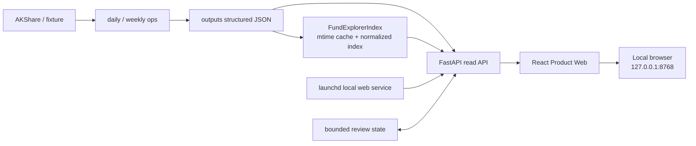

# YA FundMind OS v2.1 Local Product Web + Fund Explorer Design

## 1. 决策

`v2.1.0` 交付本地产品化 Web Console 和全市场 Fund Explorer。站点部署、D1/R2、公网访问和云端数据同步全部延期，不创建 ChatGPT Sites 项目，也不上传本地 outputs。

本地 Web 由 React 前端和 FastAPI 只读 API 组成，通过 launchd 在用户登录后自动启动，仅监听 `127.0.0.1`。daily/weekly 继续生成结构化 JSON；API 在请求时读取最新产物，因此日常数据更新不需要重新构建或重启前端。

## 2. 目标

- 提供可长期打开的本地产品界面，不再依赖手动启动。
- 支持在约 2 万只基金和 ETF 中按代码、名称、类型、主题进行搜索。
- 支持分页、排序、数据质量过滤和单只基金详情抽屉。
- 保留自选池、市场、组合、新闻、Copilot、人工审核和报告页面。
- 页面明确展示 `source`、`as_of`、stale/fallback 和缺失字段。
- 保持主评分、主风险、daily provider、watchlist、portfolio 和 scheduler 时间不变。

## 3. 不做什么

- 不部署 ChatGPT Sites、Cloudflare、Vercel 或公网服务。
- 不开放局域网监听，不增加账号体系。
- 不自动交易、不接券商、不输出买卖建议或收益承诺。
- 不把 Tiantian enrichment、实验信号直接接入主评分或主风险。
- 不在浏览器中重新计算主评分或风险结论。

## 4. 用户工作流

### 4.1 研究总览

用户打开 `http://127.0.0.1:8768` 后直接看到最新 daily 日期、数据质量、运行状态、主题数量、人工审核队列和边界提示。

### 4.2 全市场基金搜索

1. 进入“基金探索”。
2. 输入六位代码或名称片段。
3. 可按基金类型、主题、是否 ETF、数据质量筛选。
4. 结果服务端分页，默认每页 25 条，最大 100 条。
5. 可按代码、名称、1 月/3 月/6 月/1 年收益排序。
6. 点击一行打开详情抽屉，不改变 watchlist。

### 4.3 自选研究

Fund Explorer 与自选池使用同一页面的两个 tab。“全市场”用于发现和比较，“我的自选”只展示 `configs/watchlist.yaml` 对应研究产物。两者都不表示推荐。

### 4.4 本地常驻运行

安装一次 launchd 后，登录即启动。代码升级时执行本地部署脚本重新构建并重启；daily 数据更新无需重启。

## 5. 架构

### 5.1 数据来源

- 全市场基础记录：`outputs/market/market_intelligence_report.json` 的 `records`。
- 主题分类：同一文件的 `classifications`。
- 热点和趋势：market intelligence/trend JSON。
- 自选详情：`outputs/fund_details/watchlist_fund_details.json`。
- 单只补充详情：`outputs/fund_details/fund_detail_<code>.json` 和 SQLite cache。
- 组合、新闻、报告和审核继续使用现有 contract。

### 5.2 索引策略

新增 `FundExplorerIndex`：

- 首次请求加载 market intelligence JSON。
- 记录文件的 `mtime_ns` 和 size；未变化时复用内存索引。
- 对 code、name 建立小写规范化文本；按 code 合并 classification。
- 输出只保留允许字段，不返回本地路径或任意 metadata。
- 文件更新时原子替换索引；解析失败继续返回上一次成功索引并标记 stale/error。

约 2.2 万条记录可在单进程内存中安全分页，不引入新数据库。

## 6. API

### 6.1 `GET /api/funds/search`

参数：

- `q`：代码或名称片段，可空。
- `fund_type`：精确类型过滤，可空。
- `theme`：精确主题过滤，可空。
- `exchange_traded`：`true/false`，可空。
- `quality`：`normal/warning/degraded/unknown`，可空。
- `sort`：`code/name/return_1m/return_3m/return_6m/return_1y`。
- `direction`：`asc/desc`。
- `page`：最小 1。
- `page_size`：默认 25，范围 1-100。

响应包含：

- `items`
- `page`
- `page_size`
- `total`
- `total_pages`
- `facets`（fund types、themes、ETF/非 ETF 数量）
- `as_of`
- `source`
- `data_quality_grade`
- `warnings`

### 6.2 `GET /api/funds/{code}`

返回合并后的 `FundDetailView`。代码必须为六位数字；不存在返回 404。缺失字段保持 `null`，不补造值。

### 6.3 兼容

保留 `GET /api/funds` 作为自选池接口，不删除、不重命名。新增接口不改变 V1/V2 JSON contract。

## 7. 前端设计

- 保留安静、工作台式布局，不做营销页。
- 左侧导航保持总览、市场、基金探索、组合、新闻、研究助手、人工审核、报告中心。
- 基金探索页使用页面级 tab：`全市场` / `我的自选`。
- 搜索输入、类型/主题下拉和 ETF toggle 使用稳定工具栏。
- 结果使用可横向滚动的数据表；移动端改为紧凑列表，不压缩长名称。
- 点击“查看”打开 Evidence Drawer；展示净值、收益窗口、主题、同类排名、数据质量、来源、日期和缺失字段。
- loading、empty、error、stale、fallback 都有独立状态。
- 不使用颜色单独表达涨跌或风险；状态同时有文本/图标。

## 8. 本地部署

新增：

- `scripts/deploy_local_product_web.sh`：安装前端依赖、构建、验证并重启服务。
- `scripts/install_local_product_web.sh`：渲染并安装 launchd plist。
- `scripts/uninstall_local_product_web.sh`：只卸载 Web 服务，不动 daily/weekly。
- `scripts/status_local_product_web.sh`：检查 launchctl、health endpoint 和静态资源。
- `ops/launchd/com.ya-fundmind.web.plist.template`：`RunAtLoad=true`、`KeepAlive=true`、loopback `8768`。

日志写入 `outputs/logs/product-web.out.log` 和 `product-web.err.log`。安装、卸载或重启不删除 outputs、cache、runs、dashboard 或 review state。

## 9. 安全与数据边界

- API 继续使用 TrustedHost、loopback Origin 和固定 filesystem root。
- 新搜索接口只读，不接受任意 path、URL、SQL 或 provider 参数。
- 详情接口严格规范化六位基金代码。
- 报告下载继续使用 allowlist。
- Review 写入继续校验 canonical review/signal id。
- launchd 只监听 `127.0.0.1`，不使用 `0.0.0.0`。

## 10. 验收标准

- Python 全量 pytest、compileall、现有 contract 全部通过。
- 搜索 API 覆盖代码、中文名称、类型、主题、ETF、分页、排序、空结果、坏文件和热更新。
- React typecheck、单测和 production build 通过。
- Fund Explorer 在 375、768、1440 三视口无溢出、重叠或 console error。
- 使用真实 2026-07-21 market artifact 搜索至少 21,000 条记录，首屏响应符合本地交互预期。
- launchd 安装后服务自动启动，health 和首页可访问。
- daily/weekly scheduler、主评分、主风险、provider default、watchlist 和 portfolio 无 diff。

## 11. 版本与发布

- 集成候选：`v2.1.0rc1`。
- RC 通过本地常驻运行和真实数据浏览验收后发布 `v2.1.0`。
- 原 Streamlit `web-console` 保留为回退入口。
- ChatGPT Sites 作为后续独立设计，不阻塞 `v2.1.0`。
