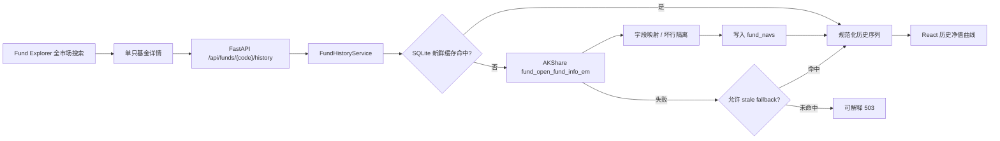

# YA FundMind OS v2.2 Fund Data Terminal 设计

## 1. 决策

`v2.2` 将产品重心从“报告展示页”推进为“基金数据终端”。系统继续保留研究、组合、新闻证据和报告能力，但基金搜索、单只基金详情、历史曲线、市场指数和板块走势成为第一层产品能力。

本版本采用分层覆盖，不对约两万只基金做无差别历史回填：

- 全市场基础层：保留代码、名称、类型、最新净值/价格、区间收益、主题、来源和数据日期。
- 跟踪层：自选池和持仓可由 daily 预热详情与历史数据。
- 按需层：用户搜索并点击单只基金时，优先读取 SQLite；缓存缺失或过期时调用 AKShare，成功后写回缓存。

多源交叉核验不作为本版本的前置条件。每份数据仍必须展示 `source`、`as_of`、`updated_at`、`expires_at`、`stale` 和失败提示，为后续核验留出接口。

## 2. 产品目标

- 用户可以在全市场搜索基金和 ETF。
- 点击任意搜索结果后，可以查看基金基础信息和历史净值曲线。
- 曲线支持 `1m / 3m / 6m / 1y / all`。
- 市场页可以查看主要指数和板块的历史走势，而不只是统计表格。
- 前端形成数据终端式信息层级，不再把报告章节简单平铺到页面。
- daily 默认 provider、主评分、主风险、watchlist、portfolio 和 scheduler 均保持不变。

## 3. 非目标

- 不做多源自动对账或交叉核验门禁。
- 不做新闻驱动推荐、自动推荐、买卖建议或收益承诺。
- 不接券商，不做自动交易。
- 不把新历史指标直接接入主评分或主风险。
- 不把全部历史数据一次性回填到本地。
- 不做公网部署；继续使用本地 Product Web。

## 4. 数据覆盖模型

| 覆盖层 | 范围 | 刷新方式 | 主要字段 |
| --- | --- | --- | --- |
| Global Basic | 全市场基金/ETF | daily 生成市场索引 | 基础信息、最新值、区间收益、主题、来源 |
| Tracked Rich | watchlist + portfolio | daily 预热，后续里程碑接入 | 详情、历史净值、数据覆盖 |
| On-demand Rich | 用户点击的基金 | 请求时 cache-first | 历史净值、累计净值、日收益、来源与新鲜度 |

## 5. 架构与数据流



后续指数和板块曲线复用同一模式，但写入独立的市场时间序列表，避免把 OHLCV 强塞进 `fund_navs`。

## 6. 数据源与字段

### 6.1 基金历史净值

首批使用 AKShare `fund_open_fund_info_em(symbol=<code>, indicator="单位净值走势")`：

- `净值日期` -> `FundNavPoint.date`
- `单位净值` -> `FundNavPoint.unit_nav`
- `日增长率` -> `FundNavPoint.daily_return`
- 若上游提供累计净值则映射到 `accumulated_nav`，否则保持 `null`
- `source` 固定为 `akshare`；缓存读取为 `cache:akshare`

坏行只增加 warning 和 `skipped_row_count`，不能使整只基金历史失败。

### 6.2 ETF、指数和板块

- ETF 第一阶段展示基金净值曲线；交易价格 OHLCV 在后续里程碑单独接入。
- 指数优先接入上证指数、沪深 300、创业板指的日线。
- 板块接入行业板块日线，并保留主题分类与板块代码映射。

这些序列只做观察展示，不进入主模型。

## 7. API 契约

新增：

```text
GET /api/funds/{code}/history?range=6m
```

响应核心字段：

- `code`
- `range`
- `point_count`
- `points[]`: `date / unit_nav / accumulated_nav / daily_return`
- `source`
- `as_of`
- `updated_at`
- `expires_at`
- `stale`
- `fallback_used`
- `data_quality_grade`
- `warnings`

`range` 只允许 `1m / 3m / 6m / 1y / all`。历史接口只接受六位基金代码，不接受 URL、路径或任意 provider 参数。

## 8. 缓存与失败策略

- 新鲜缓存命中时不访问网络。
- 新鲜缓存缺失时调用 AKShare，并将规范化点写入 `fund_navs`。
- live 调用失败时允许回退到 `cache:akshare`。
- 过期回退必须返回 `stale=true` 和 warning。
- live 与 stale cache 都不可用时返回可解释的 `503 fund_history_unavailable`。
- 默认测试只使用 mock provider，不访问真实网络。

## 9. 前端设计

基金详情抽屉升级为紧凑的数据工作区：

- 顶部显示代码、名称、净值、来源、日期和质量状态。
- 中部为历史净值曲线和 `1m / 3m / 6m / 1y / all` 分段控制。
- 曲线下方显示样本数、最新净值、区间起止日和缓存状态。
- 详情字段、缺失字段和研究边界放在次级区域。
- history 加载失败不能遮蔽已有基础详情。

后续整体终端改版采用“行情总览 / 基金终端 / 组合 / 研究证据”信息架构，分析报告退到二级入口。

## 10. v2.2 里程碑

1. **M0 基线稳定**：修复时间敏感测试，保持全量测试可复现。
2. **M1 单基金历史闭环**：AKShare 历史净值、SQLite、API、详情曲线。
3. **M2 指数走势**：上证、沪深 300、创业板日线和市场页图表。
4. **M3 板块走势**：行业板块时间序列、热门板块趋势和板块详情。
5. **M4 数据终端改版**：重组导航、页面密度、基金详情页和跨模块跳转。
6. **M5 发布收口**：真实 smoke、三视口验收、文档、CI、版本和回滚。

## 11. 验收标准

- 搜索并点击一只开放式基金后能看到真实或缓存历史净值曲线。
- 第二次请求在缓存新鲜时不再调用 AKShare。
- live 失败且缓存存在时能返回 stale/fallback 状态；无缓存时返回清晰错误。
- 默认 pytest 不访问网络。
- React 有 loading、empty、error、stale 和 success 状态。
- Python pytest、compileall、React test/typecheck/build 全部通过。
- daily 默认 provider、主评分、主风险和主报告结论不改变。

